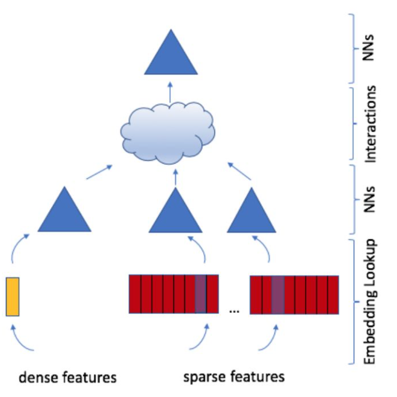

Facebook 开源深度学习推荐模型 DLRM

https://zhuanlan.zhihu.com/p/71965584

MLP 多层感知器

最基础

- 输入层
- 隐藏层
- 输出层

MLP 神经网络不同层之间是全连接的

- 权重
- 偏置
- 激活函数

#### 模型架构

特征工程

- sparse 和 dense 特征

特征建模 embedding, embedding lookup

特征转换 NNs

特征交互 Interactions 

预测 NNs

#### 特征表示 Embedding

用户和商品都含有丰富的特征信息。用户的特征通常有性别，年龄，居住地等。如何转换为模型可以处理的向量呢？

本文做法是将这些特征编码为 one-hot 的向量。

- one hot 相当于 key

然后用 embedding lookup 来得到表示。

- embedding table 相当于是存储了数据的 map
- lookup 就是通过 key 从 map 里面取 Value

例如，用户的性别。男编码为 [1,0], 女性编码为 [0,1] 然后，我们针对性别，初始化一个关于性别的 embedding matrix, 该矩阵为 2 * d, 2 代表性别的可能取值，d 代表维度。通过 embedding lookup，性别男的 embedding 其实就是 embedding matrix 的第一行，性别女的就是 embedding matrix 的第二行。

#### 特征交互

得到特征的表示后，用内积等简单操作实现模型的预测

jth user vector $v_j$, i-th product $w_i$

解决下列问题找到预测

期中 $r_{i,j}$ 是第 i 个 product 被第 j 个user打的 Rating

抓住描述特征关联性，模型的预测能力会进一步提升，例如，经典的 FM

例如: 经度和纬度分开看不能精准定位某个地区，结合起来就可以。

#### 模型预测 NNs

送入 MLP 并用 sigmoid 函数预测最终的点击概率

#### 模型并行

- 
- 特征交互和模型预测部分，参数量较少而且用户/商品数量无关，数据并行，在多个设备上计算梯度然后梯度合并

模型并行

- DLRM 模型主要来自特征的 embedding。如果有一亿个用户，对其 ID 进行 embedding, embedding matrix 就有一亿行，是一个非常大的参数矩阵。

- 将一个大的 embedding 矩阵放到多个设备上，然后更新相应的特征 embedding。（机器 and Embedding）

数据并行

- top MLP 的参数量比较小。在每个 device 上都复制一份，但是处理不同的数据
- 相当于并行化训练，得到的 gradient 可以进行相加，然后对 weight 进行更新。
- Broadcast -> learn for each -> aggregate -> broadcast

source main code: 

dlrm_s_pytorch.py

Performance BenchMarking 基准

